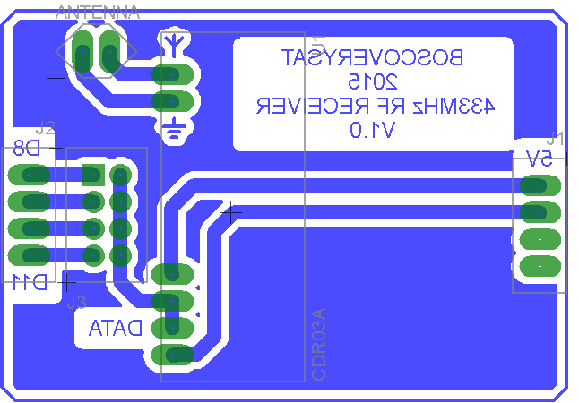

# Receptor RF 430MHz

## Resumen

Esta sección del repositorio contiene el circuito electrónico y el diseño de placa de circuito impreso del receptor de radiofracuencia, para capturar localmente y mediante Arduino, los datos enviados desde el satélite.

El diseño electrónico se ha llevado a cabo mediante el software **Eagle PCB**.

#### Diseño PCB

