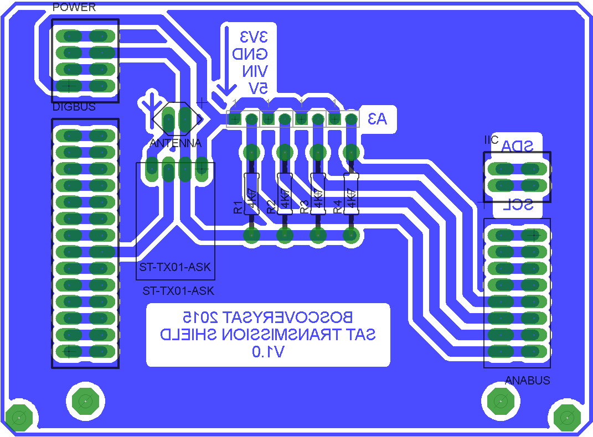

# SAT Trasmission Shield

## Resumen

Esta sección del repositorio contiene el circuito electrónico y el diseño de placa de circuito impreso para el sistema de transmisión por radiofrecuencia del satélite.

El diseño electrónico se ha llevado a cabo mediante el software **Eagle PCB**.

#### Diseño PCB

